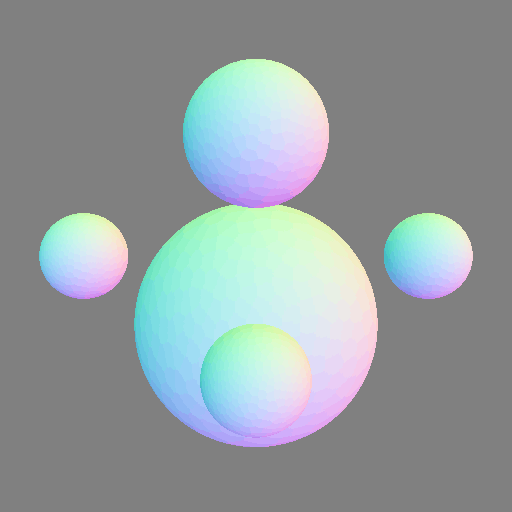

# sidequest

A open-source path tracer written in rust.

## Demo Rendering

## Resources

Here are a lot of links to webpages I have looked at.

- [Disney's Practical Guide to Path Tracing](https://www.youtube.com/watch?v=frLwRLS_ZR0)
- [The rendering equation on Wikipedia](https://en.wikipedia.org/wiki/Rendering_equation)
- [The rendering equation explained XKCD style](https://pbs.twimg.com/media/CHW_bGCUwAAIS1r?format=png)
- [The Physically Based Rendering textbook](https://www.pbrt.org/)
- [Physically based rendering intro](http://www.codinglabs.net/article_physically_based_rendering.aspx)
- [Intro To GI](https://www.scratchapixel.com/lessons/3d-basic-rendering/global-illumination-path-tracing)
- [Importance Sampling Math Hell](https://statweb.stanford.edu/~owen/mc/Ch-var-is.pdf)
- [Cook-Torrance BRDF](http://www.codinglabs.net/article_physically_based_rendering_cook_torrance.aspx)
- [Sampling a microfacet model](https://agraphicsguy.wordpress.com/2015/11/01/sampling-microfacet-brdf/)
- [How the NDF is really defined](http://www.reedbeta.com/blog/hows-the-ndf-really-defined/)
- [Multi-importance sampling](https://graphics.stanford.edu/courses/cs348b-03/papers/veach-chapter10.pdf)
